# FaceAuth AI Login System

FaceAuth is a capstone project that provides end-to-end face registration and login with a machine learning pipeline and a Streamlit interface.

## Project Scope

- Register users by capturing face images.
- Train a classifier on extracted face features.
- Authenticate users from live webcam frames.
- Accept or deny access using a confidence threshold.

## Folder Structure

face-auth-system/

- app/
  - main.py
  - pages/login.py
  - pages/register.py
  - utils.py
- data/
  - raw/
  - processed/
- models/
- src/
  - data_collection.py
  - preprocessing.py
  - feature_engineering.py
  - train.py
  - evaluate.py
  - predict.py
- tests/
  - test_pipeline.py
- notebooks/
  - exploration.ipynb
- config.py
- requirements.txt
- REPORT.md

## Setup

1. Create and activate a virtual environment.
2. Install dependencies:

pip install -r requirements.txt

## Run Application

Run from project root:

streamlit run app/main.py

## ML Pipeline Commands

Train model:

python src/train.py

Evaluate model:

python src/evaluate.py

Run baseline tests:

python -m unittest tests/test_pipeline.py

## Features Implemented

- Registration page with auto-capture.
- Login page with webcam-based authentication flow.
- Face detection and preprocessing with OpenCV.
- KNN-based classification with saved model and label encoder.
- Quality checks for low-quality registration frames.
- Confidence gating to reduce false positive authentication.

## Screenshots

### Home

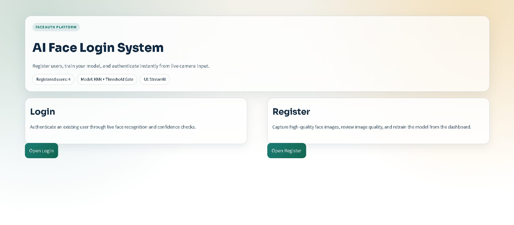

### Registration

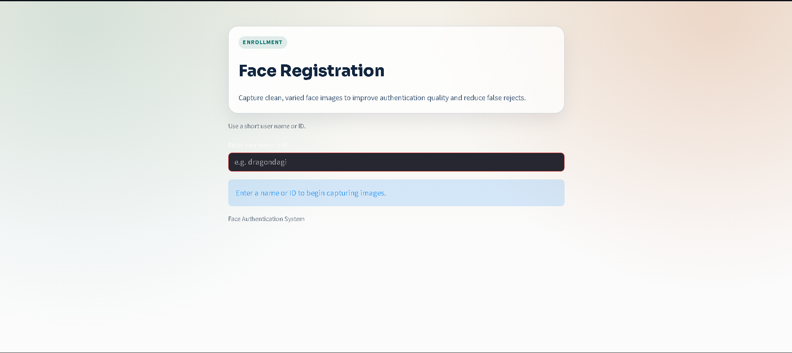
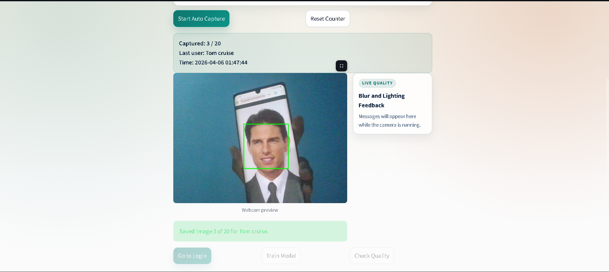
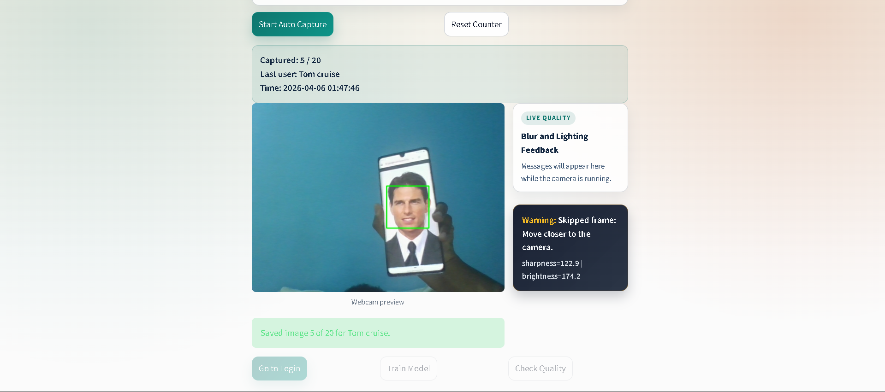
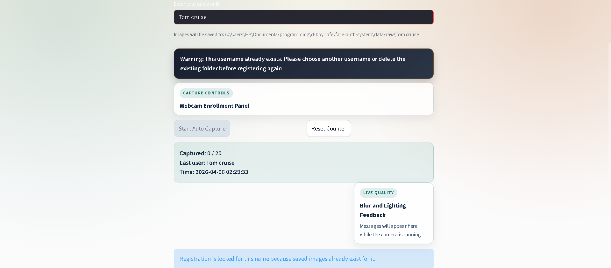
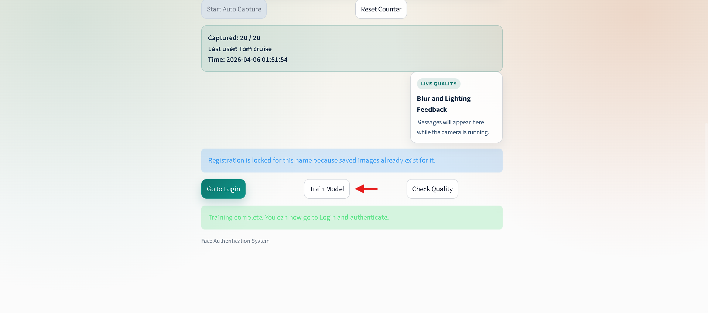
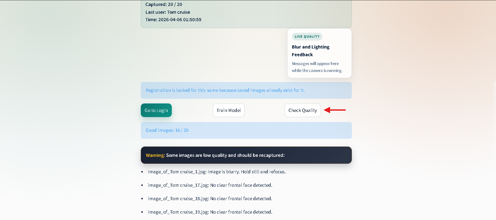

### Login

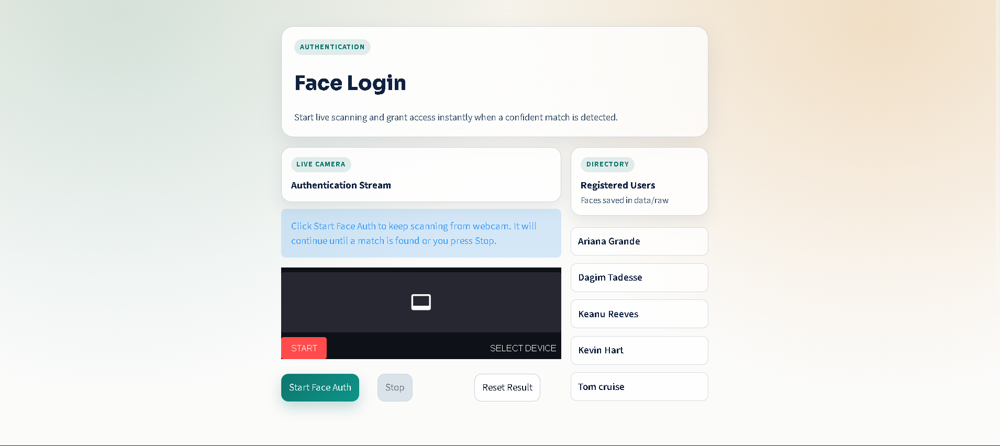
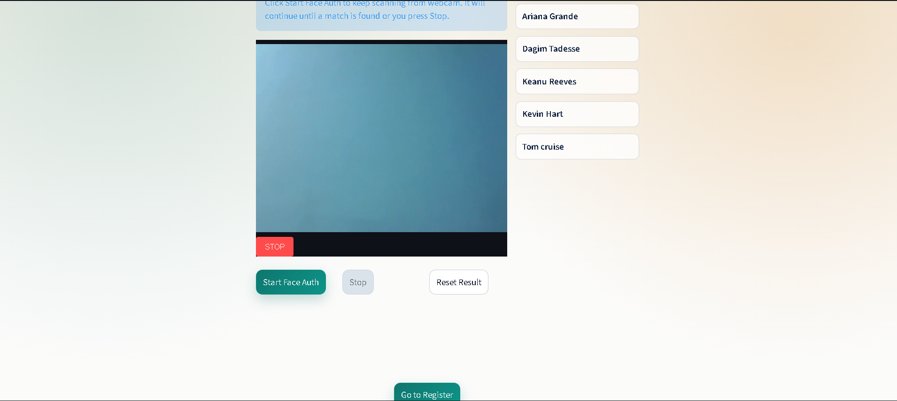
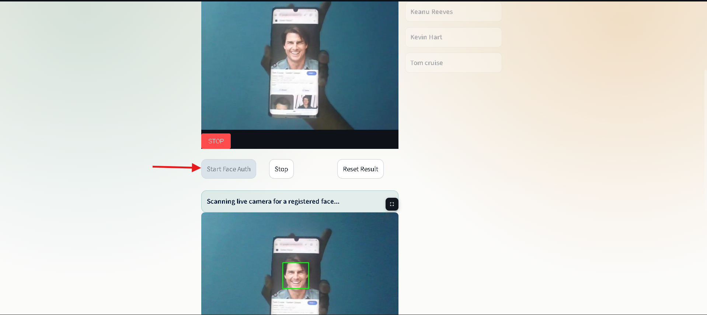

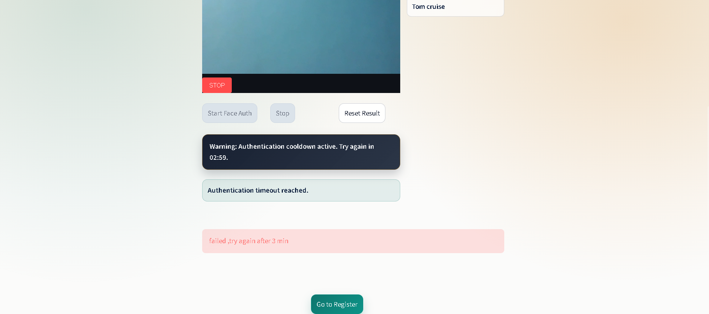

## Deliverables Checklist

- Working registration and login application.
- Machine learning training and evaluation pipeline.
- Configuration and shared project contract.
- Report document in REPORT.md.
- Baseline automated tests.

## Notes

- Keep dataset images out of source control.
- Better recognition requires diverse registration images, not repeated duplicates.
- Threshold values and quality settings are maintained in config.py.
